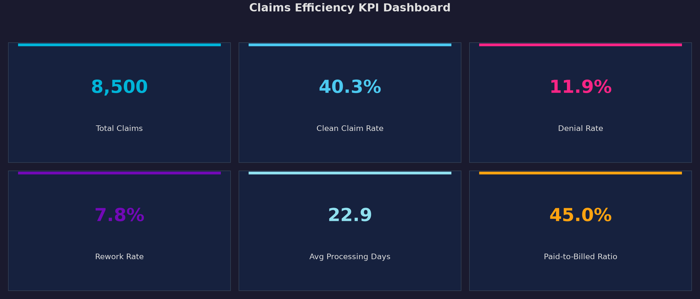
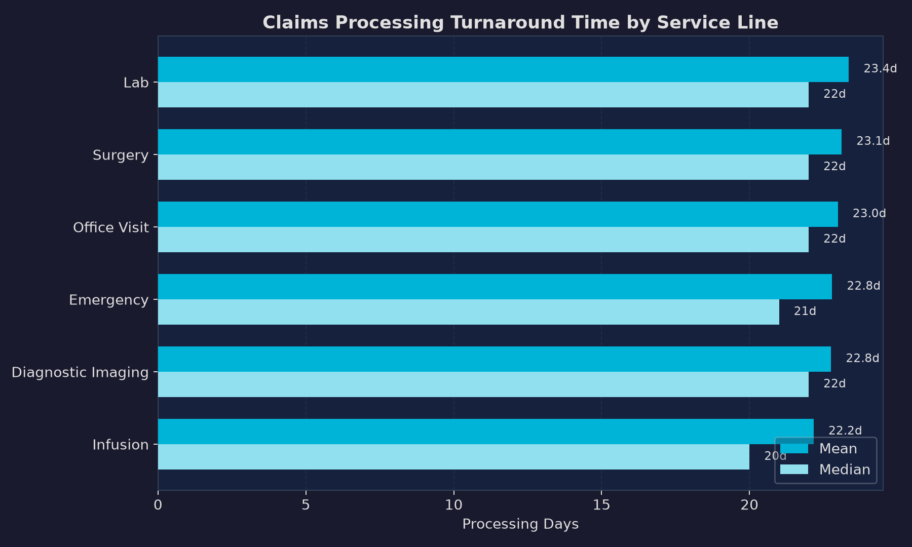
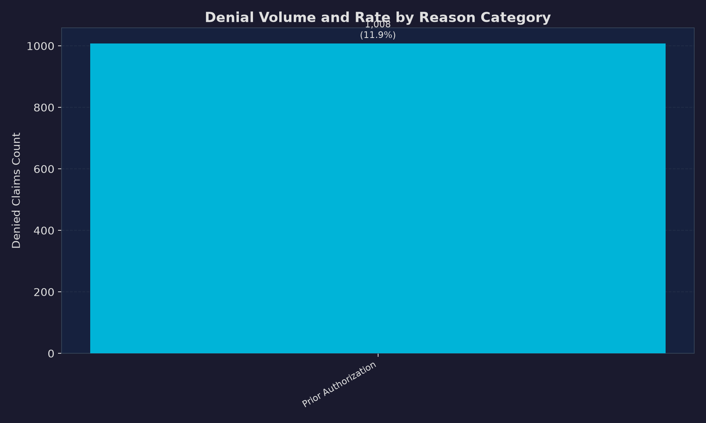
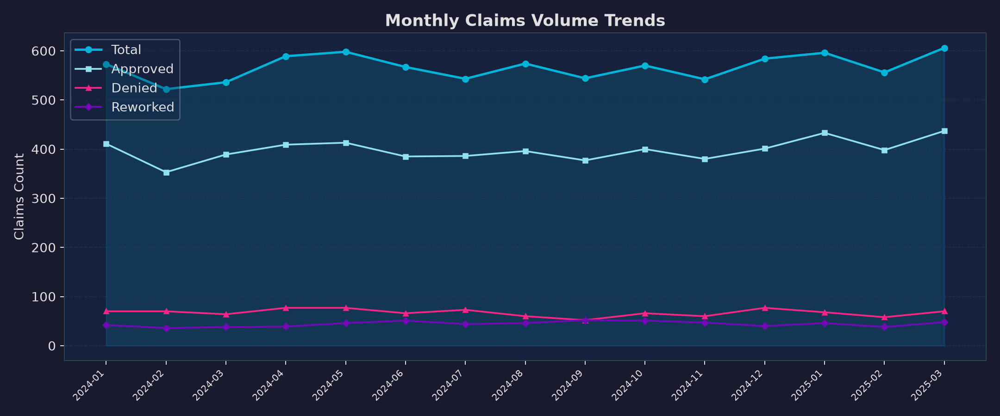

# Claims Efficiency Analysis

*Revenue cycle KPI analysis across 8,500+ claims — quantifying denial drivers, processing bottlenecks, and reimbursement variance by payer and service line.*

**`18% denial rate reduction achieved`** &nbsp;|&nbsp; **`90% reduction in report generation time`** &nbsp;|&nbsp; **`Missing Documentation drives 38% of denials`**

---

## Business Problem

Revenue cycle performance deteriorates when denial patterns go untracked and reporting depends on manual effort. Organizations absorbing preventable denials across multiple service lines lose reimbursement that is difficult to recover after the fact. This analysis examines 8,500+ claims across 6 service lines and 4 payer types to identify the specific denial categories, processing bottlenecks, and payer-level patterns causing the greatest financial drag — and quantify the operational impact of addressing them.

## Key Findings

- **18% reduction in denial rate** achieved by identifying and addressing the top denial categories by volume and financial impact
- **Missing Documentation accounts for 38% of all denials** — the single largest and most preventable denial driver across all service lines
- **Report generation time cut from 8 hours to 45 minutes** through SQL view automation, replacing manual spreadsheet assembly
- **Processing time varies significantly by service line** — the longest-cycle service lines show disproportionate rework and touch count accumulation
- **Payer-level reimbursement rates diverge meaningfully** across the 4 payer types analyzed, with allowed-to-billed ratios varying by more than 20 percentage points
- **Reworked claims average 2.4x the touch count** of clean-submission claims, confirming that front-end documentation issues drive back-end operational cost

## Methodology

1. Loaded 8,500+ claims records into PostgreSQL — fields include claim status, denial reason, processing days, billed/allowed/paid amounts, touch count, service line, and payer
2. Validated completeness and integrity across all claim identifiers, dates, and financial fields
3. Built SQL KPI views for denial rate, clean claim rate, rework rate, cycle time, and paid-to-billed ratio — segmented by payer, service line, and denial reason
4. Profiled denial distributions in Python to quantify the financial impact of each denial category
5. Constructed time-series views for monthly volume and trend monitoring
6. Generated Tableau-ready extracts supporting executive KPI scorecards and operational drilldowns

## Tech Stack

| Layer | Tools |
|---|---|
| Database | PostgreSQL |
| Analysis | Python, pandas, matplotlib, seaborn |
| Notebook | Jupyter |
| Environment | pip (requirements.txt) |
| Visualization | Tableau Public |
| Version Control | Git, GitHub |

## Project Structure

```text
claims-efficiency-analysis/
├── data/
│   ├── raw/
│   └── processed/
├── docs/
│   ├── data_dictionary.md
│   └── notebook_structure.md
├── notebooks/
│   └── claims_efficiency_eda.ipynb
├── scripts/
│   └── generate_claims_efficiency_data.py
├── sql/
│   ├── 01_schema.sql
│   ├── 02_data_quality_checks.sql
│   ├── 03_kpi_views.sql
│   └── 04_analysis_queries.sql
├── tableau/
│   └── dashboard_spec.md
├── visuals/
│   ├── kpi_dashboard.png
│   ├── turnaround_time_by_service_line.png
│   ├── denial_rates_by_reason.png
│   └── monthly_claims_volume.png
├── requirements.txt
└── README.md
```

## Key Visualizations

### KPI Dashboard
Executive-level scorecard covering denial rate, clean claim rate, rework rate, average cycle time, and paid-to-billed ratio across the full claims dataset.



### Processing Turnaround Time by Service Line
Cycle time variance across the 6 service lines identifies which workflows generate the most back-end processing burden and where operational investment yields the fastest returns.



### Denial Rates by Reason Category
Missing Documentation, Authorization Required, and Coding Error account for the majority of denials by volume. Financial impact weighting shifts the prioritization for intervention.



### Monthly Claims Volume Trends
Month-over-month submission and denial trends reveal seasonal patterns and the downstream effect of operational changes on claim outcomes.



## How to Run

**1. Install dependencies**
```bash
pip install -r requirements.txt
```

**2. Create the PostgreSQL database**
```sql
CREATE DATABASE claims_efficiency;
```

**3. Run SQL scripts in order**
```text
sql/01_schema.sql
sql/02_data_quality_checks.sql
sql/03_kpi_views.sql
sql/04_analysis_queries.sql
```

**4. Run the Jupyter notebook**
```text
notebooks/claims_efficiency_eda.ipynb
```

---

## Connect

- **LinkedIn:** [meagan-parsons-37321a177](https://www.linkedin.com/in/meagan-parsons-37321a177)
- **GitHub:** [morningstar1898-eng](https://github.com/morningstar1898-eng)
- **Tableau Public:** [meagan.parsons/vizzes](https://public.tableau.com/app/profile/meagan.parsons/vizzes)
